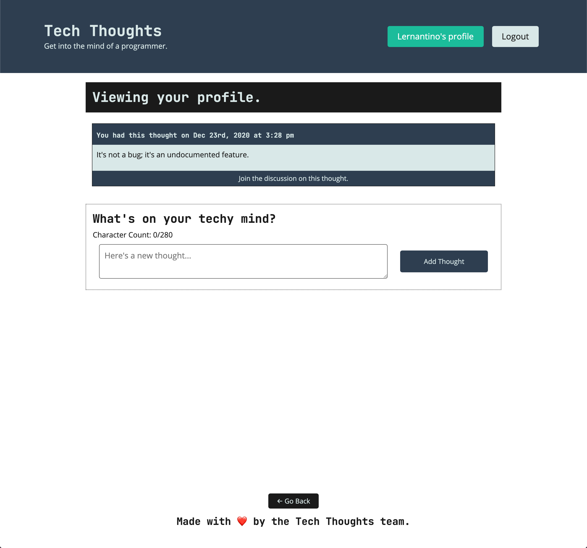

# 🐛 Profile Page Is Not Displaying the Logged-In User's Data

Work with a partner to resolve the following issue:

* As a user, I want to see my own thoughts when I visit the profile page.

## Expected Behavior

When a logged-in user visits the `/me` route, they should see the thoughts they created.

## Actual Behavior

The profile page displays a message informing the user they must be logged in to see the content.

## Steps to Reproduce the Problem

To reproduce the problem, follow these steps:


1. Run `npm install`, `npm run seed`, and `npm run develop`.

2. Open <localhost:3000/login> in the browser.

3. Log in with the following test credentials, or create your own user and some thoughts:

    ```json
    {
      "email": "lernantino@techfriends.dev",
      "password": "password10"
    }
    ```

4. Navigate to <localhost:3000/me>.

5. The app does not display the thoughts from this user.

## Assets

The following image demonstrates the profile page's appearance and functionality:



---

Use [Google](https://www.google.com) or another search engine to research this.

---
© 2024 David Oweh,University of Austin Boot Camp. Confidential and Proprietary. All Rights Reserved.
